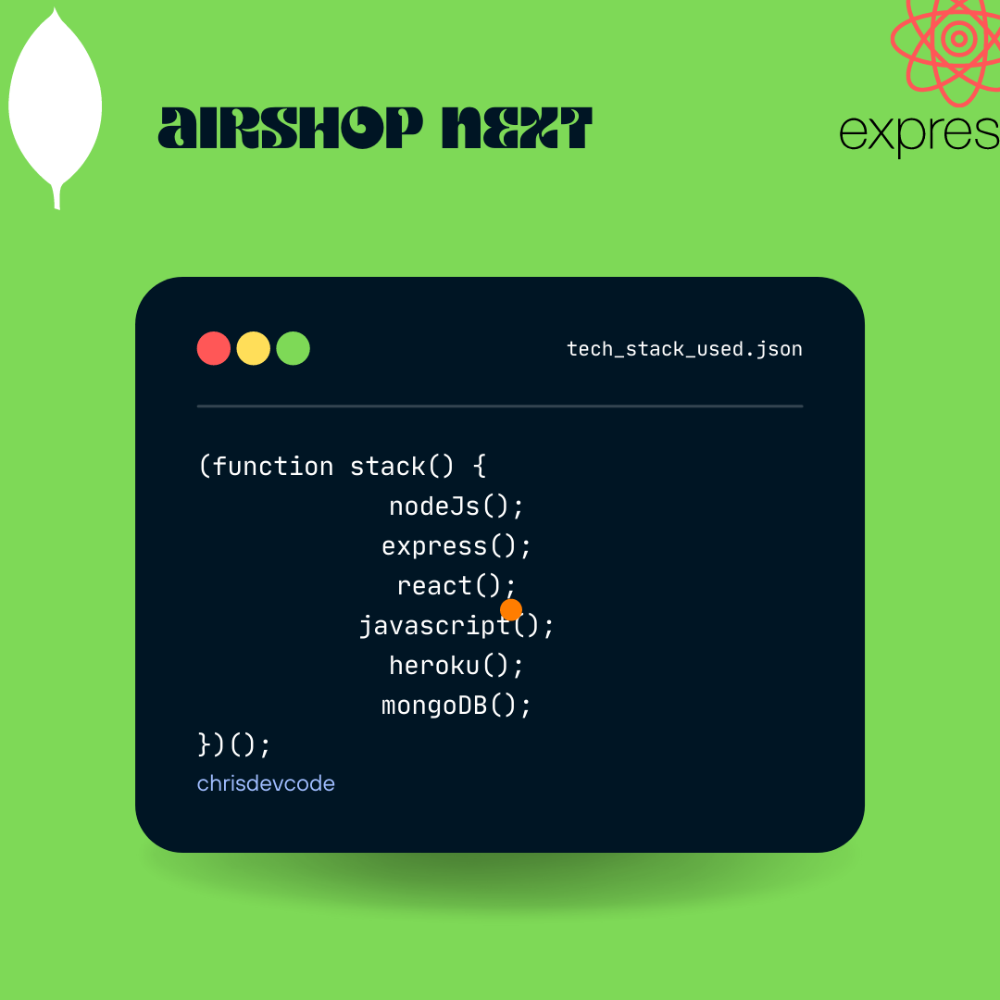

# MERNSHOP



## Server:

Directory: [server/](/server/)

## Client

Directory: [client/](/client/)

## Preparing For Deployment

Environment configurations:

```env
JWT_SECRET = 'secret'
MONGO_URI = 'mongodb_uri'
NODE_ENV = 'development'
PAYPAL_CLIENT_ID = 'paypal_id'
PORT = 5000
```

Change the NODE_ENV = 'development' to NODE_ENV = 'production' to run in production mode.

Create a build directory in the client directory,

    $ npm run build

Esure you have the code, in your `app.js` in the server directory:

```js
if (process.env.NODE_ENV === 'production') {
  app.use(express.static(path.join(__dirname, '/client/build')))

  app.get('*', (req, res) =>
    res.sendFile(path.resolve(__dirname, 'client', 'build', 'index.html'))
  )
} else {
  app.get('/', (req, res) => {
    res.send('API is running....')
  })
}
```

Run the server in production mode(simulator):

    $ npm start

## Deploying to Heroku

On the root, create a `Procfile` file:

>Tells heroku how to run the project on the server.

Add the following to the file:

    $ web: node server/app.js

Create a `heroku-postbuild` script in `package.json`:

    $ "heroku-postbuild": "NPM_CONFIG_PRODUCTION=false npm install --prefix client && npm run build --prefix client"

Add environment variables to Heroku's Config Vars.

## Bugs

1. File Uploads

## Working Updates

1. Re-write on Typescript
# finalyearproject

# finalyearproject

